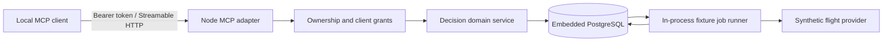

# Travel decision engine

A persistent research backend exposed through MCP. The product helps people compare travel choices using explicit constraints, source evidence and repeatable searches. It does not generate a generic itinerary or make bookings.

**Current milestone: hosted research prototype on Free Render + Supabase.** The [account page](https://trip-planning-engine.onrender.com/account), consent API and revocation controls are deployed. Health and unauthenticated endpoint checks pass. Supabase OAuth configuration and a real assistant sign-in remain unverified; live flight search is not available. Local synthetic tests cover the research workflow and the official MCP client.

## Run locally

Requires Node.js 24 and npm. No provider account or database installation is needed.

```sh
npm ci
npm run demo
npm run dev
```

`demo` uses a temporary in-memory PostgreSQL database, runs the Flaine example and prints the comparison. `dev` starts a persistent database in `.data/postgres` and serves MCP at `http://127.0.0.1:3000/mcp`. Settings are in `.env.example`; copy it to `.env` if needed. A local bearer token is generated in `.data/local-token` unless `LOCAL_TOKEN` is set. Configure a compatible **local HTTP MCP client** to send `Authorization: Bearer <that token>`. The token is never printed to service logs. This endpoint is reachable only on this computer; a cloud chat client cannot reach it.

The fixture worker runs in the same process. `start_search` returns a run ID; use `get_search_run` to poll. All synthetic fares are labelled and use example.com links. `provider: live` returns `PROVIDER_ACCESS_REQUIRED` without any external request.

```sh
npm test
npm run check
npm run build
npm start
```

`npm start` uses the compiled app with the same mode and data path. Stop the dev process first; only one process should open a given embedded database. Tests use isolated databases and do not contact flight suppliers, Supabase or other external APIs.

## The Flaine acceptance case

Confirmed inputs: **18–20 December 2026, four travelers, snowboard, all London airports**: LHR, LGW, LTN, STN, LCY and SEN.

Working assumptions: four adults, one snowboard for the party, Geneva gateway, economy examples, maximum two stops and demonstration score weights. Ages, equipment dimensions/weight, transfer arrangements, budget and departure restrictions remain unconfirmed. The fixture covers LGW only and explicitly reports the other five airports as unknown coverage. The synthetic comparison yields:

| Example | Flight price for party | Snowboard fee | Comparable total | Result |
| --- | ---: | ---: | ---: | --- |
| TEST101 | £480 | Unknown | Unknown | Conditional |
| TEST102 | £620 | £90 for one board, both directions | £710 | Meets the modeled flight constraints |
| TEST103 | £150 with unknown price basis | Unknown | Unknown | Conditional |

These are invented test cases, not researched fares. Even the complete example does not establish transfer feasibility or overall trip suitability. Selection and booking reports are separate records; synthetic evidence cannot be recorded as booked. Manually supplied evidence and booking reports remain unverified and labelled `user_reported`.

## Implemented model



`Trip → Decision → CriteriaVersion / Candidate / SearchRun → Observation`. A candidate identifies a flight itinerary; observations preserve separate dated prices and evidence. Runs reference immutable criteria versions. Selections snapshot the evaluation and rationale. Booking records capture only the user's report of an external booking.

Hard constraints produce pass/fail/unknown verdicts before preference scoring. Utility uses fixed cost and duration anchors, so adding a candidate does not change existing scores. Missing costs produce score intervals, never zero-priced equipment. Comparisons list eligible options before conditional and ineligible ones, then order by the lower score bound. Overlapping intervals do not establish a winner. Repeated searches compare like-for-like fare bases; changed criteria suppress price deltas. Missing results are never labelled sold out.

Mutations require an idempotency key. Decision mutations also require the last observed revision. Retrying identical input returns the original result; reusing the key with different input fails. Every call checks the authenticated owner and a stored client grant. Supplier/user text is treated as evidence, not instructions.

## MCP tools

| Purpose | Tools |
| --- | --- |
| Trips and evidence | `list_trips`, `create_trip`, `get_trip`, `get_decision` |
| Private policy notes | `create_policy_note`, `update_policy_note`, `get_policy_note`, `list_policy_notes` |
| Decision criteria | `create_decision`, `update_decision_criteria` |
| Search | `start_search`, `get_search_run` |
| Research | `save_candidate`, `compare_candidates`, `compare_search_runs` |
| Outcomes | `set_candidate_disposition`, `select_candidate`, `record_booking` |

The HTTP transport is stateless; application data is persistent. There is no SSE subscription or server session to recover. Clients poll saved runs. Tool errors are structured, with `isError: true`; transport authentication failures are HTTP 401.

[Private policy notes](docs/policy-notes.md) retain manually curated airline rules with sources, applicability and review dates. Updates append versions; comparisons and selections can reference an exact version. Notes are reusable across the owner's trips and remain separate from quote totals and availability. This addition is tested locally and awaiting the next hosted deployment.

## Repository

```text
src/
  app.ts           MCP adapter and HTTP protections
  auth.ts          Local token / hosted JWT verification
  accounts.ts      Direct-session sign-in verification, consent and revocation
  core.ts          Ownership, persistence, tools, fixture jobs
  domain.ts        Runtime TypeScript schemas and scoring
  database.ts      Embedded / external PostgreSQL adapters
  providers.ts     Provider boundary and synthetic examples
  policies.ts      Private, versioned policy notes and review reminders
  acceptance.ts    Confirmed Flaine inputs and assumptions
  main.ts          Configuration and process lifecycle
migrations/        Executable scaffold database schema
web/               Account and OAuth consent page
tests/             Domain, persistence, authorization and MCP tests
scripts/           Demo, migration and build asset scripts
docs/prd.md        Product requirements
docs/spike/        Earlier research and target architecture
docs/implementation.md  Delivery status and next integration gates
```

The executable schema normalizes relationships and versions while storing validated criteria and offer payloads in JSONB. The larger schema in `docs/spike/design` is a design proposal, not the applied migration. No application code was copied from the reviewed trip-planning projects. Dependency licenses remain their respective owners' licenses; no license has yet been chosen for this repository.

## Next milestone

Finish [Supabase account-linking setup and hosted acceptance](docs/account-linking.md), validate one real MCP client sign-in, then add a rights-cleared flight provider. The deployed [Blueprint](render.yaml) uses Free compute and applies migrations at startup. Service auto-deploy is off, but Blueprint changes can still sync and trigger deployment. The service checks database availability on `/health` and refuses to run local mode on Render. GitHub Actions checks the build and tests. See [implementation notes](docs/implementation.md). The shared itinerary web app follows the flight slice, before hotel integrations.
