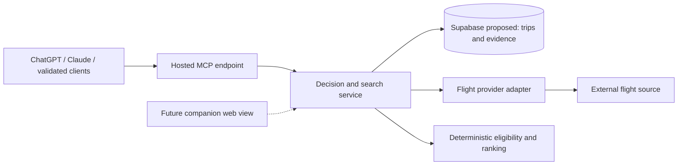

# Travel Research Engine — PRD

Version: 0.2 · 3 October 2026 · Status: proposed product requirements

This document defines the product before the technical spike. Provider availability, commercial terms, repository reuse, architecture and delivery estimates remain to be validated. Collaboration is deferred. No application scaffolding is part of this phase.

## 1. Product thesis

Help a traveler make a defensible travel decision: find feasible options, compare their real costs and practical consequences, keep the evidence, and repeat the search when circumstances change.

The core product is a persistent travel decision engine accessed primarily through a hosted MCP server from ChatGPT, Claude and other compatible assistants. The host assistant handles conversation, clarification and explanation; our backend owns trip state, live provider access, evidence, feasibility and deterministic ranking. V1 requires no separate backend LLM. Prices, availability, baggage allowances and booking status must come from evidence or explicit user input.

The initial job to be done:

> When I have a trip with practical constraints, help me choose flights I can actually use, understand the trade-offs, and check whether my shortlist has changed without starting the research again.

The first differentiator to test is continuity between searches: the same trip, explicit requirements, comparable candidates, dated evidence and an intelligible history. A conventional flight results page already handles much basic search. This product must demonstrate that retaining decision context and operational dependencies makes the next decision materially easier.

## 2. Audience and problem

The first user is an individual organizing a short leisure trip, sometimes for several travelers. They may compare several departure airports, care about after-work departures, carry sports equipment and need onward transport to work with the flights.

The initial user already uses a supported assistant and connects it to a travel account through sign-in and authorization. Private trips belong to that account and persist across conversations and connected clients. Several travelers can be represented without their own accounts. Users do not host a server, configure developer tools or supply travel-provider API keys. A full standalone web app and access for friends without an assistant are later capabilities.

Current research commonly leaves important context spread across browser tabs, screenshots, messages and notes:

- A headline fare excludes the baggage needed for the trip.
- A cheap itinerary loses usable time or cannot connect to an onward transfer.
- A claim is remembered without its source, observation time or exact fare conditions.
- A repeated search loses the previous shortlist and the reason an option was rejected.
- A selected option is mistaken for a booked one.

These are product hypotheses to test with the first trip, rather than claims established by user research.

## 3. Outcomes and validation

The primary outcome is a recorded decision supported by comparable evidence and an explicit reason for selecting it.

Proposed pilot targets, to be measured rather than advertised:

| Outcome | Pilot measure |
|---|---|
| Reach a useful shortlist | Organizer compares at least three candidates, where the connected source returns three feasible alternatives, and understands why each is included |
| Reduce repeated work | On a second search, the organizer can identify meaningful changes within two minutes without re-entering criteria |
| Understand the recommendation | Organizer can explain the top option's benefit, drawback and unresolved condition from the assistant's evidence-backed comparison |
| Preserve trust | Every displayed price has a source, observation time, currency, passenger basis and completeness label |
| Respect constraints | No candidate with a known hard-constraint failure appears as eligible; unknown required facts are visibly unresolved |
| Reach a decision | Organizer records a selection and rationale, and can separately record an external booking |

The pilot should compare the workflow with the organizer's usual flight-search-plus-notes process. Continue investing if retained evidence and repeat searches save effort or expose a consequential missed cost or constraint. If the workspace adds effort without improving decisions, narrow or reconsider the product before expanding into hotels or AI features.

## 4. Concrete v1 scope

V1 is private, single-owner flight research through remote MCP, targeting ChatGPT and Claude first, for fixed-date round trips starting with London–Geneva for the Flaine weekend. Support a bounded selection of departure airports, a single destination airport, economy travel and adult travelers. Confirm actual route and airline coverage in the spike before committing to a provider.

| Included in v1 | Deferred |
|---|---|
| Hosted MCP tools, account linking and private trips | Shared URLs, invitations, voting, comments and collaborative editing |
| One or more flight decisions per trip | Hotel, restaurant and reservation search integrations |
| Editable constraints and scoring preferences | Flexible-date calendars, multi-city travel, cabin mixing and complex traveler types |
| One live flight search integration, subject to access validation | Multi-provider aggregation and claims of comprehensive market coverage |
| Saved candidates, manual candidate entry and source links | Automated extraction from arbitrary websites or screenshots |
| Comparable flight and baggage costs, with unknowns exposed | Checkout, ticket issuance, payments, cancellations and booking servicing |
| Manual notes and unresolved conditions for transfers and check-in | Live transfer inventory, automated routing and full dependency optimization |
| On-demand repeat searches and material-change comparison | Scheduled monitoring, fare alerts and autonomous booking |
| Transparent ranking and alternative sorts | Learned personalization and opaque AI scores |
| Select, reject, restore and record externally booked options | Full web app, custom embedded UI and itinerary generation |

At least one real connected search must work for the acceptance route before v1 is described as a live research product. Manual entry through a tool is a fallback; a manual-only build is a prototype. Validate account linking and the same core workflow in ChatGPT and Claude. Muse is a prospective client whose exact product and remote MCP compatibility must be established in the spike.

## 5. Core experience

The primary surface is the user's existing assistant. A minimal website supports sign-in, account linking and connection management. The complete research workflow must work through structured MCP tools and readable results without a custom widget or full web app. An optional companion comparison page can follow when the pilot demonstrates a need.

1. **Create a trip.** Tell the assistant the name, destination, dates, traveler count and display currency. It creates or retrieves the persisted trip and its decisions through tools.
2. **Define the flight decision.** Select airports, local departure/arrival windows, passenger count, baggage requirements and any maximum known total cost. Choose preferences such as lower cost, later Friday departure or more usable time at the destination.
3. **Review the criteria.** The assistant presents structured hard constraints separately from preferences and asks about consequential ambiguity. Save explicit user requirements before searching; inferred assumptions remain visible. The backend validates criteria and never silently relaxes them.
4. **Run a search.** Return the selected source, coverage limitations and a stable SearchRun ID. Pending searches can be checked later. Partial results, no results and provider failure remain distinct outcomes even if the conversation ends.
5. **Compare candidates.** Return structured shortlist data and a concise text comparison for the assistant to present. Include local times, airport codes, stops, duration, cost breakdown, baggage, observation time, eligibility and unresolved conditions. Custom client UI is optional.
6. **Inspect the evidence.** Open the underlying offer or source link, see which facts came from the provider or the user, and understand each ranking contribution.
7. **Choose and repeat.** Save or reject candidates with a reason. Retrieve them in a new conversation or another connected client, re-run the saved criteria, and review changes. Retain the selection unless the user changes it.
8. **Record the outcome.** Mark an option selected. Open the external booking page. After booking externally, the user may ask the assistant to record it as booked, with actual paid amount and a note. A click-out alone never marks it booked.

The assistant's comparison should answer four questions: Does this fit? What will it cost? Why might I prefer it? What still needs checking? A representative repeat request is: “Recheck my Flaine flights, include a snowboard, and tell me whether my selected option is still the best fit.”

## 6. Domain model

Use Trip → Decision → Candidate as the ownership structure. A Decision also owns SearchRuns. Each SearchRun produces observations of candidates; a candidate may be encountered in many runs. Putting SearchRun only beneath Candidate would make run history and partial failures harder to represent correctly.

| Object | Meaning and essential information |
|---|---|
| Trip | Travel-account owner, name, destination, dates, display currency and traveler assumptions; ownership is independent of chat client |
| Decision | Question to resolve, type, lifecycle state, current criteria version, selected candidate and rationale |
| CriteriaVersion | Immutable snapshot of hard constraints, scoring preferences, baggage assumptions and passenger composition |
| Candidate | A stable option within a decision: for flights, a particular combination of outbound and inbound segments; user disposition and notes persist across searches |
| SearchRun | Criteria version, source, request time, completion time, outcome, coverage and errors; rerunning produces a new run |
| OfferObservation | Provider-specific purchasable fare observation for a candidate, including fare conditions, price components, passenger basis, availability signal, currency, source reference and observation time |
| Evidence | Provenance for a fact: provider response, link or manual note; observed time, scope and whether the fact is quoted, calculated or assumed |
| BookingRecord | User-reported external booking, linked candidate and offer when known, actual paid amount and timestamp |

Separate the flight itinerary from its fare offers. The same flights can have different baggage allowances, fare brands, sellers and prices. Never combine a cheap fare from one offer with a baggage entitlement from another.

Candidate disposition is independent of live availability: saved, rejected or selected candidates remain in the record when an offer disappears. A decision may move from researching to selected to booked; reopening it preserves its history. Booking is a user-reported event in v1, not provider-verified fulfillment.

Store monetary values exactly with currency and explicit units. Store flight instants and relevant IANA time zones, displaying the local date and time at each airport. Preserve source identifiers as well as normalized fields. Provider terms will determine which raw responses and historical facts may be retained and for how long.

## 7. Functional requirements

### Constraints and feasibility

- Support exact travel dates, allowed airports, passenger count, maximum stops, local time windows and required baggage. Allow a maximum total budget with explicit per-person or party scope.
- Evaluate hard constraints before ranking. A candidate is **eligible**, **ineligible** or **needs verification**. Unknown is not equivalent to passing.
- If required baggage is unpriced, the complete-price budget check remains unknown even when the base fare fits. If known costs already exceed the cap, it fails.
- Return excluded candidates and constraint-failure reasons on request through comparison tools. Never silently relax a constraint to create more results.
- Represent practical dependencies such as late transfer availability and late check-in as explicit manual conditions in v1. They do not become verified merely because a flight search succeeds.
- Changing a constraint or preference creates a new criteria version. Re-evaluation of stored facts is possible, but changes that affect the provider query require another search before claiming current coverage.

### Cost and evidence

- Display base fare, required baggage, known fees, known subtotal and unresolved costs separately. Distinguish quoted amounts, estimates and user-entered figures.
- Show party total and per-person allocation only with clear passenger assumptions. Do not multiply a one-seat quote and imply availability at that fare for the full group.
- Any currency conversion needs a dated rate and a visible converted-estimate label; retain original amounts. A simple v1 may request GBP prices and leave unsupported currencies unranked by price until conversion is available.
- Each price and availability statement must identify its source, time and scope. Terms such as “from” and indicative fares cannot be presented as quotes for the exact requested trip.
- A live search result is an observation, not a guarantee that the offer is still purchasable. Mark freshness using provider-specific policies and explicit expiry when supplied.
- Manual facts need a source link or a user-note label and an entered/observed date. Editing a manual price must not overwrite the historical observation.

### Search and comparison

- A new run preserves prior observations, shortlist and rejection reasons, subject to lawful retention limits. Retrieve this state by authenticated travel account and stable IDs; conversation memory is not the source of truth.
- Classify run outcomes as complete, partial, failed or cancelled; distinguish a completed search with no matching results from failure.
- Retain results from successful source requests when another request fails, while clearly marking incomplete coverage.
- Compare like-for-like offers when calculating price changes: itinerary, passenger count, currency, fare conditions and baggage assumptions must match. Otherwise explain that the basis changed.
- An option absent from a later run is “not returned in this search,” unless the source explicitly confirms unavailability.
- Distinguish changes to the market from changes to criteria or scoring. Price movements, schedule changes and changed baggage conditions must remain inspectable.
- Repeating a search means repeating a versioned query, not reproducing an identical market result.

### Selection and booking

- A decision has at most one active selected candidate in v1. Replacing it records the previous selection and optional reason.
- Selection may proceed with unresolved conditions after those conditions are clearly shown; the product must retain the needs-verification state. It must not relabel the option as fully feasible.
- When the selected offer is stale or has changed, prompt a refresh before external booking, without implying refresh reserves inventory.
- Preserve a recorded booking independently of later search changes. Do not automatically alter booked plans.

## 8. Ranking approach

Use deterministic, inspectable scoring. AI does not assign factual values or overrule constraints.

First partition candidates by feasibility. Rank eligible candidates using a small set of user-visible preferences. Keep candidates needing verification in a separate section with provisional comparison information; never boost them because a missing fee makes the known subtotal look cheaper.

For eligible candidates with sufficient comparable data:

`score = 100 × Σ(weight × utility) / Σ(weight)`

Each utility is bounded from 0 to 1 and has an explicit definition. Initial dimensions are comparable cost, flight timing, travel duration and stops. Operational notes such as a possible 1 a.m. check-in appear alongside the score; they only enter scoring when there is an explicit, defensible input.

Use fixed, editable reference points within a criteria version, such as a preferred price and maximum acceptable price. Avoid normalizing against whichever candidates happen to be returned: an unchanged option's score should not change merely because another option disappears. Do not double-count correlated dimensions without explaining the weight allocation.

If a required scoring input is missing, label the ranking provisional or omit the aggregate score. Do not silently redistribute its weight. Give users direct sorts by complete price, outbound departure and inbound arrival, plus an explanation such as “£35 more, but departs after work and includes the required bag.”

Record the scoring version and weights. Preference changes can rescore saved evidence without another provider call, with the age of that evidence still visible. The recommended option is the best fit among the results found under the displayed assumptions, not necessarily the cheapest flight on the market.

## 9. Flaine acceptance scenario

The initial end-to-end scenario is Flaine, 18–20 December 2026. The year is a working assumption consistent with the prior planning context and must be confirmed before a live search is treated as the user's actual booking brief.

Historical context recovered from the existing “Flaine Trip” conversation:

- An easyJet option was discussed as Friday LGW 20:05 → GVA 22:35, returning Sunday GVA 20:45 → LGW 21:25.
- The conversation described a screenshot price of ¥1,055, then estimated at about £119 per person return, before relevant extras.
- A SWISS alternative from Heathrow was discussed. An advertised route-level “from” price had been incorrectly useful as a comparison and was later identified as not an exact-date quote.
- Bringing a snowboard versus renting could materially change the cost comparison.
- Friday arrival implied a late onward transfer and accommodation check-in after midnight. Sunday timing needed to preserve useful ski time while allowing the return transfer and airport buffer.

These are historical conversation references, not independently verified current schedules, fares, baggage rules or transfer commitments. The PRD uses them as test inputs. Exact fares and policies must be re-established by a live source or explicitly retained as historical/manual examples.

Provisional setup: compare London departure airports to Geneva for fixed dates; prefer an after-work Friday departure and useful Sunday ski time. Traveler count, baggage scenario, airport choices, exact time boundaries and budget remain editable and unconfirmed. Test both “rent equipment” and “bring snowboard” scenarios as separate criteria versions.

| Acceptance test | Expected behavior |
|---|---|
| Enter the trip and flight decision | Dates, passenger assumptions, local time windows, baggage and preferences are visible before searching |
| Run a real provider query | Source and coverage are shown; actual observations are distinguishable from seeded historical examples |
| Source misses the easyJet option | Tool result discloses coverage limits; organizer can save a manual candidate through the assistant with its source and historical status |
| Compare a low base fare with a higher baggage-inclusive fare | Comparison uses matching passenger and baggage assumptions; missing equipment fees remain unresolved |
| Supply a route-level SWISS “from” price | It cannot appear as an exact-date, bookable quote or enter a complete-cost ranking |
| Find an arrival near 22:35 Friday | Late transfer and next-day check-in are explicit conditions; no fabricated reservation availability |
| Evaluate Sunday options | Show the return schedule and a user-entered transfer/buffer assumption; do not claim a guaranteed last ski time |
| Reject an inconvenient option, then repeat the search | Rejection reason persists when the same itinerary returns |
| Re-run after a price or fare-condition change | New observation is saved, differences are explained and unlike offers are not presented as a simple price movement |
| Repeat search returns no selected offer | Selection persists and is labeled not returned; it is not silently deleted or automatically declared sold out |
| Provider fails | Failure is visible, historical results retain their original timestamps and retry is available |
| Select and book externally | Selection and user-reported booking remain separate; external click-out does not imply a booking |

A pilot passes when the organizer completes the core workflow through both ChatGPT and Claude, identifies a preferred flight with trade-offs and open conditions, and records the outcome. Create the trip in one client, retrieve the same persisted decision in the other, and repeat a search without re-entering criteria. Ending a conversation must not lose saved data. Verify retry deduplication, pending-run recovery, stale-revision handling and isolation between separate accounts. Muse joins acceptance testing only after compatibility is established. Use real integration checks plus controlled fixtures; future fares are not fixed test expectations.

## 10. Quality and operating requirements

- Authenticate each MCP request and authorize access to the requested trip. Resolve identity from verified credentials, never a model-supplied user ID. Link each supported client to the same travel account through a tested OAuth flow. Keep provider credentials on the server and verify isolation using separate accounts.
- Keep data collection small: v1 does not need passports, payment cards, passenger legal names or booking-reference uploads to compare flights.
- Return concise structured data plus readable text, with explicit status labels, source references and timestamps. The core workflow must not depend on client-specific widgets. Keep sign-in pages and any future comparison view accessible on phones, keyboards and screen readers.
- Persist pending search state and expose status retrieval through get_search_run. Bound provider timeouts and retries. Use idempotency keys for paid search starts and mutations; repeat delivery of the same request must not duplicate charges or records. Protect criteria and selection updates with expected revisions to prevent silent overwrites across clients.
- Track provider request count, cost, latency, errors and search completion, plus client connection failures, tool-call failures and duplicate retries. Treat provider text as untrusted data; the server enforces permissions, budgets and constraints independently of assistant instructions.
- Establish a per-user search allowance and overall spend ceiling after provider pricing is known. Display when a limit is reached; do not substitute invented results.
- Deleting a trip removes its associated private records according to a documented retention policy. Provider restrictions may require earlier evidence expiry.

## 11. Architecture direction and spike brief

The primary entry point is a hosted HTTPS MCP endpoint. ChatGPT, Claude and other validated clients call its tools; they do not host our server. An application service owns criteria, provider queries, normalization, evidence and deterministic ranking. A future companion web view calls the same service with the same permissions. Client conversation and explanation are separate from backend authority and durable state.

Choose one initial backend host during the spike: Vercel or Render for the MCP endpoint and application logic, with Supabase as the proposed database. Minimal account pages may share that host or use Vercel when needed. These are candidates, not deployed infrastructure. Test remote MCP transport, OAuth, request duration, pending-run recovery and cost. Add a worker or durable job mechanism only when measured search behavior requires it; never rely on work continuing after a hosting request has ended. MCP, application logic and provider adapters can initially live in one deployment.

Initial tool contract: list_trips, create_trip and get_trip retrieve durable context; create_decision and update_decision_criteria manage versioned requirements; start_search and get_search_run manage live queries; compare_candidates and compare_search_runs expose trade-offs and changes; save_candidate and set_candidate_disposition support manual evidence, saving, rejection and restoration; select_candidate and record_booking record distinct outcomes. Each tool needs validated inputs, typed outputs, explicit effects and bounded results. Return stable IDs, source references, observation times, completeness and verification status. Keep full evidence retrievable without returning every historical record on each call.

After this PRD, the technical/product spike must:

1. Inspect Ripwords/ai-trip, jivanb7/trip-planner, Prot10/MyTripPlanner and seanmorley15/AdventureLog, plus stronger relevant projects discovered during research. Compare architecture, UX, data model, live sources, collaboration, deployment, maintenance and actual licenses.
2. Verify current flight, hotel, places, restaurant-reservation and routing providers using primary documentation. Record access requirements, pricing, free tiers, affiliate obligations, storage/display restrictions and whether results are indicative, live, repriceable or actually bookable. Keep implementation focused on flights.
3. Prove whether a reachable provider serves the first route, relevant carriers, exact passenger counts and needed fare/baggage fields. Document gaps and a manual fallback. An inaccessible commercial feed is not an implementation plan.
4. Produce concrete TypeScript interfaces, database schema, MCP input/output schemas and error contracts, provider capabilities, normalization and scoring rules, repo layout, deployment plan and roadmap. Prove ChatGPT and Claude account linking and tool compatibility; identify the intended Muse product and test its support before promising it.
5. Recommend build versus reuse at component level. Preserve required attribution for any permitted reuse; review actual licenses and dependencies. Treat GPL/AGPL projects as idea references unless their use is explicitly decided. A missing license is not permission to copy.
6. Present findings and architecture before scaffolding. Current scope ends at the PRD; implementation sequencing remains subject to the research findings.

## 12. Phased roadmap

| Phase | Deliverable | Exit condition |
|---|---|---|
| 0 — Product definition | This PRD and confirmed acceptance-trip assumptions | Core problem, v1 boundaries and success criteria are clear |
| 1 — Technical/product spike | Repository and provider research, MCP/auth compatibility proof and concrete architecture | Live-data access, working client authentication and a justified backend host; otherwise explicit rescope |
| 2 — Flight vertical slice | MCP tools for trip → criteria → live search → comparison → selection → repeat search | Flaine workflow passes in ChatGPT and Claude, including recovery and shared account state |
| 3 — Pilot and refinement | Real trip decisions, usability fixes and measured search cost | Evidence of improved decisions or reduced repeated effort; known operational costs |
| 4 — Hotels | Room/rate comparison, party occupancy, cancellation and check-in conditions | Provider access validated and demand demonstrated in the pilot |
| 5 — Further expansion | Restaurants/places, then reservations where access permits | Each addition has a recurring decision need and an honest data-access model |

MCP is part of v1. A companion web comparison view, custom embedded UI, collaboration and scheduled alerts are later tracks driven by pilot demand. If collaboration becomes valuable, add membership and roles, shared-URL sign-in, preferences/rejections/comments and activity history. Friends should eventually be able to review through a normal web link without an assistant account.

## 13. Open questions and decision log

| Question | Working position | Must be resolved by |
|---|---|---|
| Is the acceptance trip 18–20 December 2026? | Assume 2026 in fixtures, confirm for live use | First real acceptance search |
| How many passengers, and who brings equipment? | No inferred group count; separate baggage scenarios | First real acceptance search |
| Which London airports and time limits are acceptable? | Explicit inputs, with prior easyJet itinerary as context | First real acceptance search |
| What is the budget and required luggage? | Leave unset until supplied; do not invent a cap | First real acceptance search |
| Will the product outperform existing flight search plus notes? | Test saved context, complete cost and repeated searches | Pilot review |
| Can we access relevant live inventory economically? | Unknown | Technical spike, before implementation commitment |
| Is a separate backend LLM required at launch? | No; supported clients supply conversational intelligence | Revisit only for a demonstrated backend need |
| Is collaboration required at launch? | No; explicitly deferred by the user | Revisit after solo value is demonstrated |
| Which infrastructure and open-source code should be used? | Choose Vercel or Render for the backend; proposed Supabase database; no committed reuse | Technical spike |

Immediate next deliverable: a research-backed technical spike proving live flight data, remote MCP access, cross-client account continuity and a justified hosting choice. No substantial application code is needed to evaluate the product thesis.
