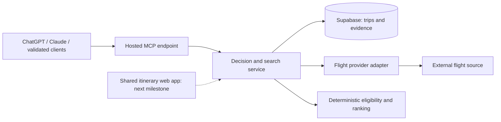

# Travel Research Engine — PRD

Version: 0.3.1 · 9 October 2026 · Status: proposed product requirements

This document defines product requirements; it is not an implementation-status report. The first vertical slice remains single-owner flight research through MCP. A shared web itinerary follows as the next product milestone, before hotel search integrations. This revision covers PRD changes only.

## 1. Product thesis

Help a traveler make a defensible travel decision: find feasible options, compare their real costs and practical consequences, keep the evidence, and repeat the search when circumstances change.

Carry those decisions into a well-presented, shared itinerary that replaces the organizer's Google Doc. Research happens through the assistant; the web app gives the organizer and friends a persistent place to review the plan, discuss individual items and agree changes. Both surfaces use the same saved trip.

The core product is a persistent travel decision engine accessed primarily through a hosted MCP server from ChatGPT, Claude and other compatible assistants. The host assistant handles conversation, clarification and explanation; our backend owns trip state, live provider access, evidence, feasibility and deterministic ranking. V1 requires no separate backend LLM. Prices, availability, baggage allowances and booking status must come from evidence or explicit user input.

The initial job to be done:

> When I have a trip with practical constraints, help me choose flights I can actually use, understand the trade-offs, and check whether my shortlist has changed without starting the research again.

The first differentiator to test is continuity between searches: the same trip, explicit requirements, comparable candidates, dated evidence and an intelligible history. A conventional flight results page already handles much of basic search. This product must demonstrate that retaining decision context and operational dependencies makes the next decision materially easier.

## 2. Audience and problem

The first user is an individual organizing a short leisure trip, sometimes for several travelers. They may compare several departure airports, care about after-work departures, carry sports equipment and need onward transport to work with the flights.

The initial user already uses a supported assistant and connects it to a travel account through sign-in and authorization. Private trips belong to that account and persist across conversations and connected clients. Several travelers can be represented without their own accounts. Users do not host a server, configure developer tools or supply travel-provider API keys. At the shared-itinerary milestone, friends join through a normal web link without an assistant account. A standalone web research interface remains a later capability.

Current research commonly leaves important context spread across browser tabs, screenshots, messages and notes:

- A headline fare excludes the baggage needed for the trip.
- A cheap itinerary loses usable time or cannot connect to an onward transfer.
- A claim is remembered without its source, observation time or exact fare conditions.
- A repeated search loses the previous shortlist and the reason an option was rejected.
- A selected option is mistaken for a booked one.
- The organizer maintains a separate Google Doc to present the trip, and discussions in messages become detached from the itinerary items they concern.

These are product hypotheses to test with the first trip, rather than claims established by user research.

## 3. Outcomes and validation

The primary outcome is a recorded decision supported by comparable evidence and an explicit reason for selecting it.

Proposed pilot targets, to be measured rather than advertised:

| Outcome | Pilot measure |
|---|---|
| Reach a useful shortlist | Organizer compares at least three candidates, where the connected source returns three feasible alternatives, and understands why each is included |
| Reduce repeated work | On a second search, the organizer can identify meaningful changes within two minutes without re-entering criteria |
| Understand the recommendation | Organizer can explain the top option's benefit, drawback and unresolved condition from the assistant's evidence-backed comparison |
| Preserve trust | Every displayed price has a source, observation time, currency, passenger basis and completeness label |
| Respect constraints | No candidate with a known hard-constraint failure appears as eligible; unknown required facts are visibly unresolved |
| Reach a decision | Organizer records a selection and rationale, and can separately record an external booking |

The pilot should compare the workflow with the organizer's usual flight-search-plus-notes process. Continue investing if retained evidence and repeat searches save effort or expose a consequential missed cost or constraint. If the workspace adds effort without improving decisions, narrow or reconsider the product before expanding into hotels or AI features.

For the shared-itinerary milestone, the primary outcome is that the organizer can organize and share the Flaine trip without maintaining a parallel Google Doc. The pilot must also show that a friend can open the itinerary on a phone, identify what is tentative versus booked, and comment or propose a change on the relevant item without using an assistant.

## 4. Concrete v1 scope

V1 is private, single-owner flight research through remote MCP, targeting ChatGPT and Claude first, for fixed-date round trips starting with London–Geneva for the Flaine weekend. Support a bounded selection of departure airports, a single destination airport, economy travel and adult travelers. Confirm actual route and airline coverage in the spike before committing to a provider.

| Included in v1 | Deferred |
|---|---|
| Hosted MCP tools, account linking and private trips | Shared itinerary, invitations, item comments and proposed changes: next milestone |
| One or more flight decisions per trip | Hotel, restaurant and reservation search integrations |
| Editable constraints and scoring preferences | Flexible-date calendars, multi-city travel, cabin mixing and complex traveler types |
| One live flight search integration, subject to access validation | Multi-provider aggregation and claims of comprehensive market coverage |
| Saved candidates, manual candidate entry and source links | Automated extraction from arbitrary websites or screenshots |
| Comparable flight and baggage costs, with unknowns exposed | Checkout, ticket issuance, payments, cancellations and booking servicing |
| Manual notes and unresolved conditions for transfers and check-in | Live transfer inventory, automated routing and full dependency optimization |
| On-demand repeat searches and material-change comparison | Scheduled monitoring, fare alerts and autonomous booking |
| Transparent ranking and alternative sorts | Learned personalization and opaque AI scores |
| Select, reject, restore and record externally booked options | Standalone web research interface, custom embedded UI and automatic itinerary generation |

At least one real connected search must work for the acceptance route before v1 is described as a live research product. Manual entry through a tool is a fallback; a manual-only build is a prototype. Validate account linking and the same core workflow in ChatGPT and Claude. Muse is a prospective client whose exact product and remote MCP compatibility must be established in the spike.

## 5. Core experience

The primary research surface is the user's existing assistant. A minimal website supports sign-in, account linking and connection management for the flight slice. The complete research workflow must work through structured MCP tools and readable results without a custom widget or full web app. The next milestone adds a companion web app for presenting and collaborating on the itinerary; a web comparison interface is a separate later possibility.

1. **Create a trip.** Tell the assistant the name, destination, dates, traveler count and display currency. It creates or retrieves the persisted trip and its decisions through tools.
2. **Define the flight decision.** Select airports, local departure/arrival windows, passenger count, baggage requirements and any maximum known total cost. Choose preferences such as lower cost, later Friday departure or more usable time at the destination.
3. **Review the criteria.** The assistant presents structured hard constraints separately from preferences and asks about consequential ambiguity. Save explicit user requirements before searching; inferred assumptions remain visible. The backend validates criteria and never silently relaxes them.
4. **Run a search.** Return the selected source, coverage limitations and a stable SearchRun ID. Pending searches can be checked later. Partial results, no results and provider failure remain distinct outcomes even if the conversation ends.
5. **Compare candidates.** Return structured shortlist data and a concise text comparison for the assistant to present. Include local times, airport codes, stops, duration, cost breakdown, baggage, observation time, eligibility and unresolved conditions. Custom client UI is optional.
6. **Inspect the evidence.** Open the underlying offer or source link, see which facts came from the provider or the user, and understand each ranking contribution.
7. **Choose and repeat.** Save or reject candidates with a reason. Retrieve them in a new conversation or another connected client, re-run the saved criteria, and review changes. Retain the selection unless the user changes it.
8. **Record the outcome.** Mark an option selected. Open the external booking page. After booking externally, the user may ask the assistant to record it as booked, with actual paid amount and a note. A click-out alone never marks it booked.

The assistant's comparison should answer four questions: Does this fit? What will it cost? Why might I prefer it? What still needs checking? A representative repeat request is: “Recheck my Flaine flights, include a snowboard, and tell me whether my selected option is still the best fit.”

Each client connects by signing into the same travel account on the companion site. The authorization screen identifies that account; connection management shows linked clients. Trips are keyed to the verified account ID, not a chat identity or an inferred email match. If a trip is missing, show the signed-in account and offer account switching; never merge accounts or their trips automatically.

Resolve trip references within the authenticated account. A stable trip ID is authoritative. For a name such as “my Flaine flights,” show matching trip names, dates and IDs; if more than one plausible match exists, ask the user to choose before starting a search or changing state. A fuzzy match must not silently select a trip. If no match exists, ask whether to create one.

### Shared itinerary experience — next milestone

The web app presents a day-by-day itinerary with a clear trip overview. Flights, accommodation, transfers, activities and general notes are structured items with optional freeform detail. Show local dates and times, locations, useful links, practical notes and explicit tentative or booked status. Unscheduled items remain visible without inventing times. Support manual entries so the complete trip can be organized before hotel, activity or restaurant integrations exist.

1. **Build the plan.** The organizer adds selected flights to the itinerary and enters accommodation, transfers and activities manually. Linked research retains its evidence and unresolved conditions. Selection makes an item tentative; booking status requires a separate booking record or explicit user report.
2. **Share the trip.** The organizer invites friends through a normal web link. Friends authenticate to access a private trip and need no assistant account. View-only members can read; collaborators can comment and propose changes; the organizer controls membership and the agreed plan.
3. **Discuss an item.** A friend attaches a comment or proposed change to a flight, stay, transfer or activity. General discussion can attach to the trip. Proposals show the existing value and suggested replacement, author and pending status.
4. **Agree a change.** The organizer accepts or declines the proposal. An accepted change updates the shared plan and records who proposed and approved it. Direct organizer edits also appear in the activity history. A proposed change never silently replaces an agreed or booked item.
5. **Use the itinerary.** Everyone sees the latest agreed plan on a phone, including open questions. The organizer retrieves and updates the same trip through MCP; updates made in either surface are visible when the other reloads the trip.

The initial milestone excludes simultaneous document editing, voting, complex permissions and automatic itinerary generation. The goal is to replace the organizer's working Google Doc with a clearer plan and discussion attached to the relevant items.

## 6. Domain model

Use Trip → Decision → Candidate as the ownership structure. A Decision also owns SearchRuns. Each SearchRun produces observations of candidates; a candidate may be encountered in many runs. Putting SearchRun only beneath Candidate would make run history and partial failures harder to represent correctly.

| Object | Meaning and essential information |
|---|---|
| Trip | Travel-account owner, name, destination, dates, display currency and traveler assumptions; ownership is independent of chat client |
| Decision | Question to resolve, type, lifecycle state, current criteria version, selected candidate and rationale |
| CriteriaVersion | Immutable snapshot of hard constraints, scoring preferences, baggage assumptions and passenger composition |
| Candidate | A stable option within a decision: for flights, a particular combination of outbound and inbound segments; user disposition and notes persist across searches |
| SearchRun | Criteria version, source, request time, completion time, outcome, coverage and errors; rerunning produces a new run |
| OfferObservation | Provider-specific purchasable fare observation for a candidate, including fare conditions, price components, passenger basis, availability signal, currency, source reference and observation time |
| Evidence | Provenance for a fact: provider response, link or manual note; observed time, scope and whether the fact is quoted, calculated or assumed |
| BookingRecord | User-reported external booking, linked candidate and offer when known, actual paid amount and timestamp |

The shared-itinerary milestone adds these objects to the same trip, without requiring a research decision for every manual item:

| Object | Meaning and essential information |
|---|---|
| ItineraryItem | Trip, item type, title, optional local dates/times and time zones, location, links, freeform notes, plan status and revision; optional links to a decision, selected candidate and booking record |
| TripMembership | Authenticated account, trip and role: organizer, collaborator or viewer; invitation and revocation state |
| Comment | Author, trip or itinerary-item target, text and timestamps; discussion does not itself change the agreed plan |
| ChangeProposal | Author, proposed addition or target item for edit/removal, proposed values, expected revision for an existing item, pending/accepted/declined status and organizer resolution |
| ActivityEvent | Actor, target, action and time; enough before/after context to explain an accepted proposal or organizer edit |

The initial Trip owner is the organizer. A represented traveler is not automatically a member. Linked itinerary items reference saved research and booking records rather than creating independent copies of those facts. Later searches never automatically replace itinerary choices or recorded bookings. Display booking status from the linked record when present; manual booking reports remain visibly user-reported.

Separate the flight itinerary from its fare offers. The same flights can have different baggage allowances, fare brands, sellers and prices. Never combine a cheap fare from one offer with a baggage entitlement from another.

Candidate disposition is independent of live availability: saved, rejected or selected candidates remain in the record when an offer disappears. A decision may move from researching to selected to booked; reopening it preserves its history. Booking is a user-reported event in v1, not provider-verified fulfillment.

Store monetary values exactly with currency and explicit units. Store flight instants and relevant IANA time zones, displaying the local date and time at each airport. Preserve source identifiers as well as normalized fields. Provider terms will determine which raw responses and historical facts may be retained and for how long.

## 7. Functional requirements

### Constraints and feasibility

- Support exact travel dates, allowed airports, passenger count, maximum stops, local time windows and required baggage. Allow a maximum total budget with explicit per-person or party scope.
- Evaluate hard constraints before ranking. A candidate is **eligible**, **ineligible** or **needs verification**. Unknown is not equivalent to passing.
- If required baggage is unpriced, the complete-price budget check remains unknown even when the base fare fits. If known costs already exceed the cap, it fails.
- Return excluded candidates and constraint-failure reasons on request through comparison tools. Never silently relax a constraint to create more results.
- Represent practical dependencies such as late transfer availability and late check-in as explicit manual conditions in v1. They do not become verified merely because a flight search succeeds.
- Changing a constraint or preference creates a new criteria version. Re-evaluation of stored facts is possible, but changes that affect the provider query require another search before claiming current coverage.

### Cost and evidence

- Display base fare, required baggage, known fees, known subtotal and unresolved costs separately. Distinguish quoted amounts, estimates and user-entered figures.
- Show party total and per-person allocation only with clear passenger assumptions. Do not multiply a one-seat quote and imply availability at that fare for the full group.
- Any currency conversion needs a dated rate and a visible converted-estimate label; retain original amounts. A simple v1 may request GBP prices and leave unsupported currencies unranked by price until conversion is available.
- Each price and availability statement must identify its source, time and scope. Terms such as “from” and indicative fares cannot be presented as quotes for the exact requested trip.
- A live search result is an observation, not a guarantee that the offer is still purchasable. Mark freshness using provider-specific policies and explicit expiry when supplied.
- Manual facts need a source link or a user-note label and an entered/observed date. Editing a manual price must not overwrite the historical observation.

### Search and comparison

- A new run preserves prior observations, shortlist and rejection reasons, subject to lawful retention limits. Retrieve this state by authenticated travel account and stable IDs; conversation memory is not the source of truth.
- Classify run outcomes as complete, partial, failed or cancelled; distinguish a completed search with no matching results from failure.
- Retain results from successful source requests when another request fails, while clearly marking incomplete coverage.
- Compare like-for-like offers when calculating price changes: itinerary, passenger count, currency, fare conditions and baggage assumptions must match. Otherwise explain that the basis changed.
- An option absent from a later run is “not returned in this search,” unless the source explicitly confirms unavailability.
- Distinguish changes to the market from changes to criteria or scoring. Price movements, schedule changes and changed baggage conditions must remain inspectable.
- Repeating a search means repeating a versioned query, not reproducing an identical market result.

### Selection and booking

- A decision has at most one active selected candidate in v1. Replacing it records the previous selection and optional reason.
- Selection may proceed with unresolved conditions after those conditions are clearly shown; the product must retain the needs-verification state. It must not relabel the option as fully feasible.
- When the selected offer is stale or has changed, prompt a refresh before external booking, without implying refresh reserves inventory.
- Preserve a recorded booking independently of later search changes. Do not automatically alter booked plans.

### Shared itinerary and collaboration — next milestone

- Present the complete trip in a mobile-friendly day-by-day view with an overview, readable item detail and a visible place for unscheduled items. The organizer can add, edit, remove and reorder structured items and freeform notes.
- Support flights, accommodation, transfers, activities and general notes without requiring live integrations for each type. Optional fields must stay optional; unknown times, costs and booking status must not be filled with invented values.
- Keep tentative plans, user-reported bookings and unresolved conditions visibly distinct. Comments or proposal approval never constitute a booking.
- Allow the organizer to add a selected candidate to the itinerary explicitly. Replacing a research selection flags a linked itinerary item for reconciliation; the organizer chooses whether to update the plan. Preserve the prior choice in history and never automatically modify a booked item.
- Use the same authoritative trip state for web and MCP. The organizer can retrieve itinerary items and discussion, manage items and resolve proposals through either surface. Collaboration writes use the same permission and revision rules in both surfaces; the web workflow works without an assistant.
- Let the organizer invite viewers or collaborators and revoke access. An invitation URL is a path to authenticated membership, not a public disclosure of the itinerary. Public anonymous sharing is outside the initial milestone.
- Let collaborators comment on items or the trip and propose item additions, edits or removals. Viewers can read the plan and discussion. Only the organizer changes the agreed plan or resolves proposals in the initial milestone.
- Record authors and timestamps for comments, proposals and plan changes. Retain discussions when items are removed, with a clear removed-item label. Show pending proposals and unresolved questions alongside the relevant item.
- Reject acceptance of a proposal against a changed item revision and ask the organizer to review it against the current plan. Concurrent edits must not silently overwrite each other.
- Do not require synchronous co-editing, voting, custom roles, automated notifications or hotel/restaurant search to complete this milestone.

## 8. Ranking approach

Use deterministic, inspectable scoring. AI does not assign factual values or overrule constraints.

First partition candidates by feasibility. Rank eligible candidates using a small set of user-visible preferences. Keep candidates needing verification in a separate section with provisional comparison information; never boost them because a missing fee makes the known subtotal look cheaper.

For eligible candidates with sufficient comparable data:

`score = 100 × Σ(weight × utility) / Σ(weight)`

Each utility is bounded from 0 to 1 and has an explicit definition. Initial dimensions are comparable cost, flight timing, travel duration and stops. Operational notes such as a possible 1 a.m. check-in appear alongside the score; they only enter scoring when there is an explicit, defensible input.

Use fixed, editable reference points within a criteria version, such as a preferred price and maximum acceptable price. Avoid normalizing against whichever candidates happen to be returned: an unchanged option's score should not change merely because another option disappears. Do not double-count correlated dimensions without explaining the weight allocation.

If a required scoring input is missing, label the ranking provisional or omit the aggregate score. Do not silently redistribute its weight. Give users direct sorts by complete price, outbound departure and inbound arrival, plus an explanation such as “£35 more, but departs after work and includes the required bag.”

Record the scoring version and weights. Preference changes can rescore saved evidence without another provider call, with the age of that evidence still visible. The recommended option is the best fit among the results found under the displayed assumptions, not necessarily the cheapest flight on the market.

Users set an importance level for each scoring dimension through update_decision_criteria: off = 0, low = 1, medium = 2 and high = 3. Initial defaults are cost = medium, flight timing = off, duration = medium and stops = low. Timing can be enabled only after its preferred windows and utility anchors are explicit. Present the levels, numeric mapping and anchors before the first ranked comparison and save them in the criteria version. The assistant may propose changes from natural language, but must show the proposed settings and obtain confirmation before saving them; it must never silently invent weights. Defaults and mapping are versioned product settings, not learned personalization. Hard constraints remain independent of importance levels.

## 9. Flaine acceptance scenario

The initial end-to-end scenario is Flaine, 18–20 December 2026. The user confirmed the year, four travelers, bringing a snowboard and all London airports. Treat four adults and one snowboard as explicit test assumptions until ages and equipment quantity are confirmed.

Historical context recovered from the existing “Flaine Trip” conversation:

- An easyJet option was discussed as Friday LGW 20:05 → GVA 22:35, returning Sunday GVA 20:45 → LGW 21:25.
- The conversation described a screenshot price of ¥1,055 and an estimated £119 per person return, before extras. The source currency and conversion are unverified: the ¥ symbol alone does not identify JPY versus CNY. Exclude this amount from numeric fare fixtures and ranking until the original currency, price basis and dated conversion are verified.
- A SWISS alternative from Heathrow was discussed. An advertised route-level “from” price had been incorrectly useful as a comparison and was later identified as not an exact-date quote.
- Bringing a snowboard versus renting could materially change the cost comparison.
- Friday arrival implied a late onward transfer and accommodation check-in after midnight. Sunday timing needed to preserve useful ski time while allowing the return transfer and airport buffer.

These are historical conversation references, not independently verified current schedules, fares, baggage rules or transfer commitments. The PRD uses them as test inputs. Exact fares and policies must be re-established by a live source or explicitly retained as historical/manual examples.

Acceptance setup: compare all London airports (LHR, LGW, LCY, LTN, STN and SEN) to Geneva for the confirmed dates and four travelers, including a snowboard. Prefer an after-work Friday departure and useful Sunday ski time; exact time boundaries, other luggage and budget remain unset until supplied. Geneva, economy, four adults and one snowboard are labeled test assumptions. A “rent equipment” scenario is an optional separate criteria version and must not replace the confirmed bring-snowboard brief.

| Acceptance test | Expected behavior |
|---|---|
| Enter the trip and flight decision | Dates, passenger assumptions, local time windows, baggage and preferences are visible before searching |
| Run a real provider query | Source and coverage are shown; actual observations are distinguishable from seeded historical examples |
| Validate low-cost-carrier baggage coverage | Test easyJet LGW–GVA for the confirmed dates and four travelers; record whether the source returns exact-trip offers, fare-specific baggage allowance and snowboard availability/pricing for each direction. Distinguish unsupported fields from genuine no-results; unknown equipment costs prevent a complete-cost claim |
| Source misses the easyJet option | Tool result discloses coverage limits; organizer can save a manual candidate through the assistant with its source and historical status |
| Compare a low base fare with a higher baggage-inclusive fare | Comparison uses matching passenger and baggage assumptions; missing equipment fees remain unresolved |
| Supply a route-level SWISS “from” price | It cannot appear as an exact-date, bookable quote or enter a complete-cost ranking |
| Find an arrival near 22:35 Friday | Late transfer and next-day check-in are explicit conditions; no fabricated reservation availability |
| Evaluate Sunday options | Show the return schedule and a user-entered transfer/buffer assumption; do not claim a guaranteed last ski time |
| Reject an inconvenient option, then repeat the search | Rejection reason persists when the same itinerary returns |
| Re-run after a price or fare-condition change | New observation is saved, differences are explained and unlike offers are not presented as a simple price movement |
| Repeat search returns no selected offer | Selection persists and is labeled not returned; it is not silently deleted or automatically declared sold out |
| Provider fails | Failure is visible, historical results retain their original timestamps and retry is available |
| Select and book externally | Selection and user-reported booking remain separate; external click-out does not imply a booking |

A pilot passes when the organizer completes the core workflow through both ChatGPT and Claude, identifies a preferred flight with trade-offs and open conditions, and records the outcome. Create the trip in one client, retrieve the same persisted decision in the other, and repeat a search without re-entering criteria. Ending a conversation must not lose saved data. Verify retry deduplication, pending-run recovery, stale-revision handling and isolation between separate accounts. Muse joins acceptance testing only after compatibility is established. Use real integration checks plus controlled fixtures; future fares are not fixed test expectations.

### Shared itinerary acceptance scenario — next milestone

The organizer uses the same Flaine trip to assemble flights, accommodation, Friday and Sunday transfers, ski activities and practical notes. Entries may be manual; this scenario does not depend on adding hotel or activity providers.

| Acceptance test | Expected behavior |
|---|---|
| Assemble the complete weekend | A readable day-by-day itinerary shows the trip overview, local times, locations, links and notes; missing times and unresolved transfer/check-in conditions remain explicit |
| Add a selected flight and manually entered accommodation | The flight remains tentative until a booking is recorded; manually reported bookings are labelled; research evidence is accessible from the linked item |
| Invite a friend who has no assistant account | The friend signs in through a normal web link and can open the private itinerary on a phone with the assigned role |
| Comment on the late Friday transfer | The discussion appears on that transfer and retains author and time; the agreed transfer is unchanged |
| Propose an earlier flight or a new activity | The proposal is pending and visible in context; it does not replace the plan until the organizer accepts it |
| Accept or decline a proposal | The decision and actors are recorded; acceptance updates the relevant plan item, while decline leaves the agreed plan unchanged |
| The item changes before proposal acceptance | Acceptance requires review against the latest item; no newer organizer edit is silently overwritten |
| Change the plan through web or MCP | Retrieving the trip in the other surface shows the same items, discussion and proposal outcomes |
| A repeat search changes a fare or research selection | Bookings persist; research changes are visible and selection changes require explicit reconciliation with the itinerary |
| Revoke a member or attempt access from another account | Revoked and nonmember accounts cannot retrieve the private trip through web or MCP; viewers cannot write comments or proposals |
| Use the trip without a parallel Google Doc | The organizer can maintain the full plan and friends can review, discuss and propose changes entirely within the shared itinerary |

The milestone passes when the organizer completes this scenario and can retire the Google Doc as the working itinerary. Verify one real friend collaboration session, role enforcement, revocation and conflicting edits, as well as web/MCP state continuity.

## 10. Quality and operating requirements

- Authenticate each MCP request and authorize access to the requested trip. Resolve identity from verified credentials, never a model-supplied user ID. Link each supported client to the same travel account through a tested OAuth flow. Keep provider credentials on the server and verify isolation using separate accounts.
- Keep data collection small: v1 does not need passports, payment cards, passenger legal names or booking-reference uploads to compare flights.
- Return concise structured data plus readable text, with explicit status labels, source references and timestamps. The core workflow must not depend on client-specific widgets. Keep sign-in pages and any future comparison view accessible on phones, keyboards and screen readers.
- Persist pending search state and expose status retrieval through get_search_run. Bound provider timeouts and retries. Use idempotency keys for paid search starts and mutations; repeat delivery of the same request must not duplicate charges or records. Protect criteria and selection updates with expected revisions to prevent silent overwrites across clients.
- Track provider request count, cost, latency, errors and search completion, plus client connection failures, tool-call failures and duplicate retries. Treat provider text as untrusted data; the server enforces permissions, budgets and constraints independently of assistant instructions.
- Before enabling live searches, the spike must set a target searches-per-trip allowance and maximum provider cost per trip. Cost one all-London-airports search, a repeat search and bounded retries, including per-airport fan-out and any reprice or baggage calls. Publish the resulting allowance and spend ceiling as explicit launch settings; numeric values remain TBD until an accessible provider's pricing is verified. If normal repeat-search use exceeds the viable budget, change the provider, allowance or scope before launch. Display limits when reached; do not substitute invented results.
- Deleting a trip removes its associated private records according to a documented retention policy. Provider restrictions may require earlier evidence expiry.
- At the shared-itinerary milestone, apply trip membership and role authorization to every web and MCP read or write, including comments, proposals, history and linked evidence. Invitations and membership grants must be bounded and revocable. Keep private booking details out of the shared view unless the organizer explicitly includes them; comparing or presenting the itinerary does not require passports, payment details or booking-reference uploads.
- Make the itinerary and collaboration controls usable on phones, keyboards and screen readers. Show local date/time context for overnight transfers and stays, including travel across time zones. Protect itinerary writes and proposal resolutions with expected revisions and idempotency where retrying could duplicate actions.

## 11. Architecture direction and spike brief

The primary research entry point is a hosted HTTPS MCP endpoint. ChatGPT, Claude and other validated clients call its tools; they do not host our server. An application service owns criteria, provider queries, normalization, evidence and deterministic ranking. The next-milestone companion web app calls the same service for the shared itinerary, discussion and proposals with the same permissions. Client conversation and explanation are separate from backend authority and durable state.

The selected initial architecture is one Render service for the hosted MCP endpoint and application logic, with Supabase for Postgres and account identity. Use the approved free tiers for the prototype; no paid upgrade is authorized. The Supabase project exists and Render deployment is approved but awaits database-password entry. Account linking, live provider access and end-to-end hosted acceptance remain unverified. Minimal account pages should share the initial service where practical; add Vercel only if the companion web app needs it. Validate remote MCP transport, OAuth, request duration, pending-run recovery and cost. Add a separate worker only when measured search behavior requires it; never rely on work continuing after a hosting request has ended. MCP, application logic and provider adapters initially share one deployment.

Initial tool contract: list_trips, create_trip and get_trip retrieve durable context; create_decision and update_decision_criteria manage versioned requirements; start_search and get_search_run manage live queries; compare_candidates and compare_search_runs expose trade-offs and changes; save_candidate and set_candidate_disposition support manual evidence, saving, rejection and restoration; select_candidate and record_booking record distinct outcomes. Each tool needs validated inputs, typed outputs, explicit effects and bounded results. Return stable IDs, source references, observation times, completeness and verification status. Keep full evidence retrievable without returning every historical record on each call.

At the shared-itinerary milestone, extend the service and MCP contract to retrieve and manage itinerary items, comments, proposals and membership. Define exact tool names and schemas during milestone design. Web and MCP must reference the same item IDs and revisions; presenting the itinerary does not require a separate backend LLM.

The technical/product spike and remaining validation must:

1. Inspect Ripwords/ai-trip, jivanb7/trip-planner, Prot10/MyTripPlanner and seanmorley15/AdventureLog, plus stronger relevant projects discovered during research. Compare architecture, UX, data model, live sources, collaboration, deployment, maintenance and actual licenses.
2. Verify current flight, hotel, places, restaurant-reservation and routing providers using primary documentation. Record access requirements, pricing, free tiers, affiliate obligations and whether results are indicative, live, repriceable or actually bookable. Treat permission to cache, retain and redisplay observations for dated evidence and repeat-search comparison as a go/no-go criterion before committing to the provider-dependent data architecture. Record permitted fields, retention windows, expiry/deletion rules, attribution and display restrictions. If the core continuity workflow is prohibited, select another provider or explicitly rescope; do not assume storing a normalized copy avoids the restriction. Keep implementation focused on flights.
3. Prove whether a reachable provider serves the first route, relevant carriers, exact passenger counts and needed fare/baggage fields. Specifically test easyJet LGW–GVA for the confirmed Flaine dates and four travelers, including fare-specific baggage allowance and snowboard availability/pricing in each direction. Distinguish unsupported carrier/ancillary coverage from a completed search returning no offers. Capture reproducible capability evidence without assuming a particular future fare must exist. Document gaps and a manual fallback; require an explicit rescope if the provider cannot support the baggage-aware hero scenario. An inaccessible commercial feed is not an implementation plan.
4. Produce concrete TypeScript interfaces, database schema, MCP input/output schemas and error contracts, provider capabilities, normalization and scoring rules, repo layout, deployment plan and roadmap. Prove ChatGPT and Claude account linking and tool compatibility; identify the intended Muse product and test its support before promising it.
5. Recommend build versus reuse at component level. Preserve required attribution for any permitted reuse; review actual licenses and dependencies. Treat GPL/AGPL projects as idea references unless their use is explicitly decided. A missing license is not permission to copy.
6. Present remaining validation findings before expanding implementation commitments. Include repeat-search unit economics, the shared-itinerary access model and state continuity. This PRD update does not itself implement those requirements.

## 12. Phased roadmap

| Phase | Deliverable | Exit condition |
|---|---|---|
| 0 — Product definition | This PRD and confirmed acceptance-trip assumptions | Core problem, v1 boundaries and success criteria are clear |
| 1 — Technical/product spike | Repository and provider research, MCP/auth compatibility proof and concrete architecture | Live-data and baggage access, permitted retention/redisplay, viable searches-per-trip budget, working client authentication and a justified backend host; otherwise explicit rescope |
| 2 — Flight vertical slice | MCP tools for trip → criteria → live search → comparison → selection → repeat search | Flaine workflow passes in ChatGPT and Claude, including recovery and shared account state |
| 3 — Shared web itinerary | Day-by-day plan, manual trip items, invitations, item comments, proposed changes and organizer approval; shared state with MCP | Organizer maintains and shares the Flaine trip without a parallel Google Doc; a friend collaborates on a phone without an assistant; permissions and conflict handling pass |
| 4 — Pilot and refinement | Real trip decisions and shared itineraries, usability fixes and measured search cost | Evidence of improved decisions or reduced repeated effort, successful replacement of the working Google Doc and known operational costs |
| 5 — Accommodation | Hotels, apartments, chalets, aparthotels and holiday rentals; compare whole-party stay cost, sleeping layout, cancellation and check-in conditions | Provider access validated and demand demonstrated in the pilot; unsupported sources can be represented by links and user-reported evidence |
| 6 — Further expansion | Restaurants/places, then reservations where access permits | Each addition has a recurring decision need and an honest data-access model |

MCP is part of the first flight slice. The shared itinerary and direct collaboration are the next committed product milestone, before hotel search integrations. Start with manual accommodation, transfer and activity entries. A standalone web comparison interface, custom embedded UI, voting, simultaneous document editing and scheduled alerts remain later tracks driven by pilot demand.

Accommodation research includes Airbnb-style entire-place stays as well as hotel rooms. Model property type separately from seller/platform. For Flaine, consider alternative configurations such as two rooms or one apartment/chalet for four, without treating either configuration as a confirmed preference. Include mandatory cleaning/service fees, linen and local taxes in comparable stay cost only when supported by evidence; show refundable security deposits separately. Preserve bedrooms, actual bed layout, bathrooms, kitchen, minimum stays, location precision and late-arrival conditions. Airbnb links and user-reported details are in scope even if automated Airbnb search is unavailable. Provider coverage must state which sources and stay configurations were actually searched.

## 13. Open questions and decision log

| Question | Working position | Must be resolved by |
|---|---|---|
| Is the acceptance trip 18–20 December 2026? | Confirmed by the user | Resolved |
| How many passengers, and who brings equipment? | Four travelers and a snowboard confirmed; four adults and one board remain test assumptions | Confirm ages and equipment quantity before booking-ready comparison |
| Which London airports and time limits are acceptable? | All London airports confirmed; exact Friday/Sunday time limits remain unset | Confirm time boundaries before a constrained live search |
| What is the budget and required luggage? | Snowboard confirmed; budget and other luggage remain unset; do not invent a cap | First real acceptance search |
| Will the product outperform existing flight search plus notes? | Test saved context, complete cost and repeated searches | Pilot review |
| Can we access relevant live inventory economically? | Unknown | Technical spike, before implementation commitment |
| Is a separate backend LLM required at launch? | No; supported clients supply conversational intelligence | Revisit only for a demonstrated backend need |
| When do itinerary presentation and collaboration arrive? | User approved the shared web itinerary as the next milestone after the flight slice, before hotel search integrations | Shared-itinerary milestone |
| What should the shared itinerary replace? | The organizer's working Google Doc; friends review and collaborate on the itinerary directly without an assistant account | Shared-itinerary acceptance pilot |
| Who controls changes to the agreed plan? | Organizer edits directly and accepts or declines collaborator proposals; viewers read only | Shared-itinerary design |
| How much Google Docs functionality is required? | Structured items and freeform notes; simultaneous document editing, voting and complex permissions are deferred | Revisit from shared-itinerary pilot feedback |
| Which infrastructure and open-source code should be used? | Render service plus Supabase selected on free tiers; Supabase created and Render deployment pending password entry; no committed project-code reuse | Hosted acceptance and component-level license review |

Delivery order: validate live flight data, retention rights, search economics, remote MCP access and cross-client account continuity; complete the flight research slice; then deliver the shared web itinerary and collaboration before adding hotel search integrations. Application implementation and deployment status are tracked separately from this requirements document.
