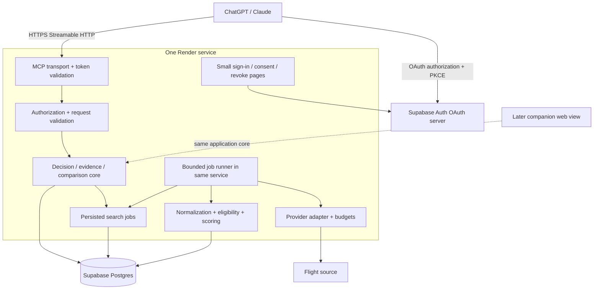
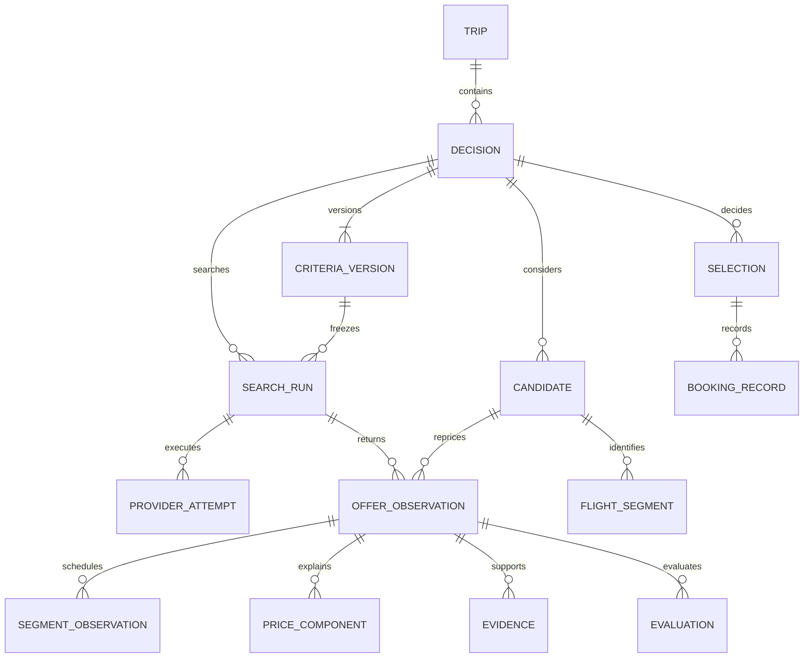

# Architecture and delivery plan

Proposed, not deployed. Provider access and cross-client OAuth still need runtime proof.

## Deployment choice

| Choice | Fit for this product | Decision |
|---|---|---|
| Vercel + Supabase | Good when a Next.js web UI is central. Bounded MCP calls work; durable background progress requires deliberate orchestration rather than an unawaited promise | Viable alternative, but no full web UI currently justifies selecting it |
| Vercel + Supabase + Render worker/API | Two application deployments, inter-service authentication and coordination before there is meaningful workload | Defer |
| **Render service + Supabase** | One Node service serves minimal account UI, HTTP MCP and a small persisted job runner; ordinary process lifecycle and recoverable jobs | **Choose for the first hosted proof** |
| Supabase Edge Functions + static consent UI | Official MCP/auth building blocks available; fewer hosting vendors, but separate consent hosting and runtime limits still need validation | Credible alternative; no clear advantage for this Node-oriented bounded job design |

Use Render's smallest suitable paid always-on service, initially one instance, with Supabase in a nearby supported region. Current entry compute is approximately $7/month; Supabase Pro starts at $25/month. With SerpApi Starter at $25, plan on roughly **$57/month base**, plus domain, email and excess usage. A private proof can use Supabase Free and SerpApi Free, lowering base compute to approximately $7; Supabase Free may pause after inactivity and is not the recommended dependable pilot configuration. These are estimates, not purchased services. [Render pricing](https://render.com/pricing), [Render free limitations](https://render.com/docs/free), [Supabase pricing](https://supabase.com/pricing), [SerpApi pricing](https://serpapi.com/pricing).

Vercel Hobby is limited to personal/non-commercial use; do not assume a future commercial product can stay on it. Its documented function duration limits are not client tool-call guarantees. Whichever host is used, MCP should return a saved search ID quickly and provide status through later bounded calls. [Vercel plans](https://vercel.com/pricing), [function duration](https://vercel.com/docs/functions/configuring-functions/duration).



## Auth and tenancy

Supabase Auth now has an OAuth 2.1 server, PKCE, discovery and dynamic client registration. It can therefore be the authorization server for **our travel MCP**; Supabase's developer/admin MCP is a different product and must not be exposed to travelers. We still host the consent UI. [Supabase OAuth](https://supabase.com/docs/guides/auth/oauth-server), [MCP authentication](https://supabase.com/docs/guides/auth/oauth-server/mcp-authentication).

Publish protected-resource metadata and an unauthenticated `WWW-Authenticate` challenge. Use a maintained MCP SDK. Validate token signature, expiry, issuer and intended audience/resource; verify client identity and the server-owned grant on every call. Use a Supabase custom access-token hook if required for resource-specific audience. Prove the resulting tokens in both clients before considering the integration done. Do not invent custom OAuth scope support: request supported identity scopes, and store travel permissions (`read`, `write`, `search`) in our own explicit consent grants keyed by account/client. Revoke those grants server-side so revocation does not wait for JWT expiry. [OpenAI auth requirements](https://developers.openai.com/plugins/build/auth), [Supabase token security](https://supabase.com/docs/guides/auth/oauth-server/token-security).

An account is the authenticated Supabase user ID, not a client session, email string or model-supplied owner ID. ChatGPT and Claude must sign into the same travel account to see the same records. Linking separate sign-in identities is an explicit account operation. Resolve ownership through database relations; never trust a supplied trip/decision/candidate ID alone. Read-only consent cannot start paid searches. No provider key, service role key, refresh token or unrestricted SQL tool is returned to a client. The proposed SQL defaults to denying direct data access; authenticated transactional entry points and grants must be implemented and tested before enabling it.

Initial browser pages: sign in, consent, connected clients/revoke, account deletion/export, privacy/terms and basic service status. No flight UI framework, maps or chat window yet. Target ChatGPT and Claude remote connectors first; exact Muse product and compatibility remain unconfirmed. [OpenAI server guide](https://developers.openai.com/plugins/build/mcp-server), [Claude remote connectors](https://support.claude.com/en/articles/11175166-get-started-with-custom-connectors-using-remote-mcp).

## Data model



Canonical flight identity uses ordered operating carrier/flight number, departure local date, origin and destination. Scheduled timestamps are observations so a schedule change can be detected on the same candidate. If operating identity is missing, keep a provider-scoped identity and report uncertain deduplication rather than falsely merging. A seller/fare/party variant is an offer observation, not a new trip. Compare prices only across matching itinerary, party, cabin, seller/fare terms, equipment basis and currency; otherwise label the comparison's changed basis.

Criteria versions are immutable snapshots of normalized constraints and preferences. Search runs reference one version, adapter/query versions and a currency/market. An edit creates a new version; it never changes what an old run meant. Do not store a candidate's current price as authoritative. Selection references the exact observed offer and criteria used, records a rationale and can be superseded. Booking is a separate user-reported fact, never inferred from selection or a link click.

Money uses integer minor units and ISO currency. Retain the provider's original currency and basis. A derived group total requires a documented per-person basis and inventory quote for the whole party. Keep currency conversion separately sourced and dated; v1 can simply compare GBP quotes and flag others instead of adding an FX dependency.

## Search execution and recovery

`start_search` atomically checks ownership/grant, expected decision revision, idempotency key and budget; stores a run and job; returns the run ID. It does not wait for all supplier work. A runner in the same Render process claims one due job with a database lease and fencing token. Bounded concurrency starts at two provider calls globally. State lives in Postgres, not memory.

Each attempt reserves its request budget in a transaction **before** sending, stores a request hash and provider request ID as soon as available, and records unknown outcomes distinctly. A lease expires after a crash; recovery claims a new generation and ignores stale completion writes. On shutdown, stop claiming and release/recover safely. Do not promise exactly-once external requests: if a supplier lacks idempotency or reconciliation, an ambiguous send remains `outcome_unknown` until a deliberate budgeted retry. Terminal partial results remain usable with a coverage report. Status reads never initiate paid work.

A periodic sweep within the always-on process finds abandoned leases on startup and during operation. No Redis, separate queue or standalone worker initially. Split the runner into a worker only when API latency or provider concurrency measurements justify it. Persisted leases allow that move without changing the tool contract. Cancellation stops new calls; an in-flight call may finish or be billable. A newly changed criterion marks active old-version results as based on earlier requirements, rather than silently cancelling them.

## MCP contract

All IDs are UUIDs; validate dates, currencies, integer money and enums at runtime. Never accept arbitrary provider URLs. Mutations carry an idempotency key; updates to mutable state also carry expected revision. An idempotency key reused with a different normalized payload returns `IDEMPOTENCY_CONFLICT`. Output has `schemaVersion`, stable IDs, `asOf`, evidence references and an explicit result/error union. Pagination and top-N bounds prevent large histories entering every chat turn.

| Tool | Input and result | Effect |
|---|---|---|
| `list_trips`, `get_trip` | Cursor/limit or trip ID → compact owned state | Read |
| `create_trip`, `create_decision` | Validated brief, dates/party or trip ID/title → created ID and revision | Write |
| `update_decision_criteria` | Decision ID, expected revision, complete criteria → new immutable criteria version | Write |
| `start_search` | Decision/criteria IDs, expected revision, idempotency key, fresh/cache mode → saved run ID/status | Write + external metered request; never booking |
| `get_search_run` | Run ID/cursor → status, coverage, offers, outstanding facts | Read; no implicit refresh |
| `compare_candidates` | Decision/criteria ID, observation IDs (max 20) → feasibility groups and versioned score explanations | Read/compute |
| `compare_search_runs` | Two run IDs in one decision → new/not-seen/changed observations and comparability warnings | Read |
| `save_candidate` | Validated itinerary and user-observed evidence, source URL/time/basis → candidate + manual observation | Write; cannot mark provider-verified |
| `set_candidate_disposition` | Candidate ID, saved/rejected/neutral, reason, expected revision → state | Write; rejection survives repeated searches |
| `select_candidate` | Observation/criteria IDs, rationale, expected revision → selection and unresolved conditions | Write; conditional selection allowed with clear record |
| `record_booking` | Selection ID, booked date, user-confirmed amount/reference summary → external booking record | Write; no supplier transaction |

Errors: `UNAUTHENTICATED`, `FORBIDDEN_OR_NOT_FOUND`, `VALIDATION_ERROR`, `REVISION_CONFLICT`, `IDEMPOTENCY_CONFLICT`, `BUDGET_EXCEEDED`, `PROVIDER_UNAVAILABLE`, `PROVIDER_ACCESS_REQUIRED`, `OUTCOME_UNKNOWN`, `EVIDENCE_EXPIRED`. Include retryability and safe next action; never raw secrets/stack traces. Tool annotations must reflect actual effects: search is not read-only, and booking-record creation does not imply purchase capability. Provider text stays data; it cannot authorize tools or overwrite criteria.

## Eligibility and ranking

1. Check hard constraints with three-valued results: pass, fail, unknown. Known failure → ineligible; any unknown required fact → conditional. Keep unsupported criteria visible, never drop them because a provider lacks a field.
2. Calculate comparable price only when the total basis is complete. For Flaine this includes party flight cost and required snowboard carriage; transfer/access costs can be separate scenario components. Missing fees stay null with a reason. Do not subtract costs that are already included or count the board for every traveler.
3. Rank eligible offers with fixed anchors in the frozen preferences. Each known metric is scaled to [0,1] using its declared best/worst anchors, direction and clamping. Score = 100 × sum(weight × utility). Weights sum to 1. Anchors and weights are proposed values until the user accepts them; no hidden learned preference.
4. For missing preference metrics, return score bounds: known weighted contribution is the lower bound; add missing weights for the upper bound. Report coverage and avoid a definitive winner when intervals overlap. Show conditional options separately, with the same uncertainty explanation. Freshness is a visible status/eligibility policy, not a secret price bonus.
5. Tie-break identical complete scores by lower comparable group cost, shorter duration, then stable candidate ID. Preserve Pareto alternatives: cheapest, most usable time, simplest journey. Do not normalize against today's result min/max; that changes scores merely because a new candidate appeared.

Suggested pilot preference dimensions are cost, usable destination time and total travel burden. Do not score usable ski time until transfer duration, airport buffers and the intended ski window have explicit assumptions/evidence. The pilot can initially show those trade-offs without one numeric overall score. Store algorithm version, criteria version, observation IDs, evaluation time and metric breakdown so the explanation is reproducible.

Repeat-search diffs distinguish a price change from a changed fare basis, newly returned candidate, not-seen candidate, expired evidence and provider failure. “Not returned” is not “sold out.” Mixed currency totals are not directly comparable. Re-evaluation under new criteria is separate from a market-price change.

## Proposed repository

```text
apps/service/src/
  http/                 # MCP endpoint, discovery, account pages, health
  mcp/                  # tools and runtime schemas
  jobs/                 # leases, recovery, budgets, provider attempts
packages/core/src/
  decisions/ evidence/ normalization/ ranking/ comparisons/
packages/providers/src/
  contract.ts manual/ serpapi/   # optional later: skyscanner, letsfg
packages/db/
  migrations/ transactions/ queries/
tests/
  contracts/ isolation/ recovery/ scoring/ acceptance/
docs/
  prd.md spike/ decisions/ provider-rights/ operations.md
THIRD_PARTY_NOTICES.md
```

Use one package manager and a supported pinned Node LTS. Keep shared domain types free of framework dependencies. Runtime schemas are the boundary source of truth, with derived TypeScript types; the accompanying interfaces express the design, not a second permanent schema authority.

## Deployment and roadmap

| Phase | Work | Exit condition |
|---|---|---|
| 0: This spike | Product/repository/API research, schema and execution design | Findings presented; remaining proof gates explicitly recorded |
| 1: Access/auth proof | Confirm pilot provider rights/key; minimal OAuth consent + `create_trip`/`get_trip` through two clients; one exact-party search | Same account works across ChatGPT/Claude; other account denied; request basis/baggage gaps understood |
| 2: Flight vertical slice | Criteria versions, persisted bounded searches, observations, eligibility, comparison, selection and external booking record | Flaine acceptance cases pass with real source plus deterministic recovery fixtures |
| 3: Pilot | Two searches on real trips; measure time saved, errors, request cost and missing data | Organizer can explain changes in under two minutes without re-entering context; a material decision benefit is demonstrated |
| 4: Hotels | Exact occupancy/rooms, full stay cost, cancellation, fees, live recheck | Supplier approval and like-for-like rate comparison work |
| 5: Places/restaurants | Sourced place shortlist, opening hours and booking links; approved availability later | No opening-hours-to-availability inference; provider rights and costs understood |
| Later: collaboration | Normal shared web URL, sign-in, membership, votes/preferences/rejections/comments, selected/booked view | Friends can participate without MCP, assistant account, API keys or setup |

For the hosted proof: create separate development and pilot environments, apply reviewed migrations, configure auth redirect/consent URLs, install secrets through host settings, set provider spend ceilings and deploy the same service build. Run transport initialization, schema validation, OAuth sign-in/refresh/revoke, cross-account access, duplicate mutation and crash-recovery checks. Log IDs/latency/request counts, not tokens or full private prompts. Document backup/restore and roll back service versions without destructive schema changes. Expose health separately from provider availability.

Later collaboration adds trip memberships (owner/editor/reviewer), expiring hashed invite tokens redeemed after sign-in, per-user preferences/votes, comments and audit events. URLs identify the shared resource; they do not grant anonymous access by themselves. Preserve individual votes separately from the organizer's selected outcome. These tables and UI are deliberately outside v1.
